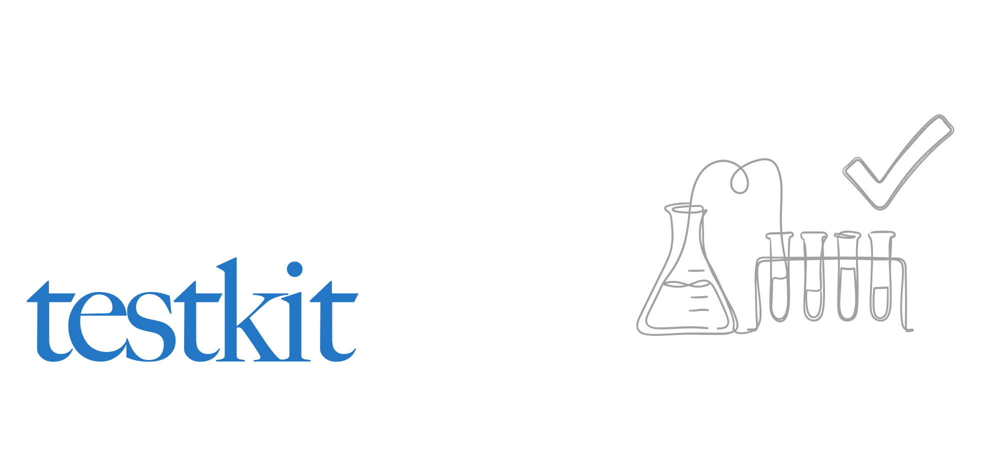

<p>
    <a href="charming_testkit.png"></a><br>
    <a href="https://crates.io/crates/charming-testkit"></a>
</p>

# Charming Testkit (`charming-testkit`)

**Charming Testkit** is a small support crate for the [Charming](https://github.com/coderbants) port family: helpers for driving and asserting against terminal applications under test — PTY sessions, key/mouse sequence builders, and screen text predicates. It backs the interactive integration tests in the other Charming crates.

It's part of the Charming port family of the Bubble Tea ecosystem and is used by [charming-bubbletea](https://github.com/coderbants/charming-bubbletea), [charming-bubbles](https://github.com/coderbants/charming-bubbles), [charming-lipgloss](https://github.com/coderbants/charming-lipgloss) and [charming-ultraviolet](https://github.com/coderbants/charming-ultraviolet).

## Installation

Add it as a dev-dependency:

```sh
cargo add --dev charming-testkit
```

## License

MIT
